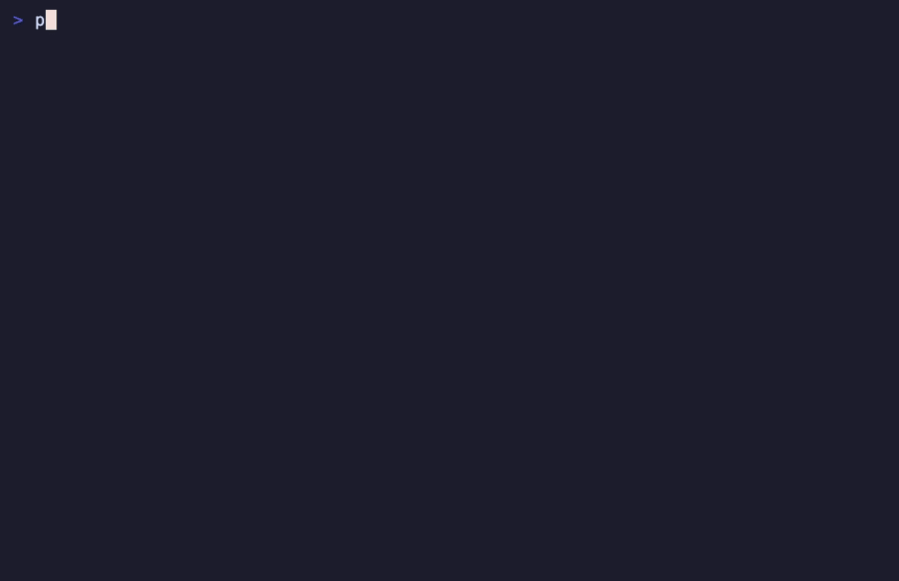

# PoisonChain

[](https://youtu.be/nNCPH2xuIw4)

📄 **[발표 슬라이드 자료 다운로드 (PDF)](public/youtube/PoisonChain.pdf)**

[English](README.md)

PoisonChain은 npm 공급망 공격 대응용 인시던트 리스폰스 툴킷이다. 보안팀이 가장 먼저 받아야 하는 질문, 즉 어떤 저장소가 노출됐는지, 누가 담당자인지, 공격 시간대에 어떤 빌드가 실제로 실행됐는지, 각 팀이 다음에 무엇을 해야 하는지를 빠르게 정리한다.

저장소 스캔, semver 리스크 분석, 빌드 로그 점검, 담당자 식별, 보고서 생성까지를 하나의 재실행 가능한 파이프라인으로 묶는다. 스프레드시트, 임시 스크립트, 메신저 보고로 흩어지던 작업을 한 번에 운영 가능한 형태로 바꾸는 것이 목적이다.

> 악성 패키지 퍼블리시부터 팀별 영향 보고서까지, 하나의 파이프라인으로 정리한다.

<p align="center">
  
</p>

<p align="center">
  <sub><code>scripts/nexus_proxy_scan.py</code>가 SSOT의 모든 타깃을 사내 Nexus에서 점검하는 화면. KISA 명단에 있지만 OSV/GHSA로 확정되지 않은 항목은 별도 🟡 <code>suspected</code> 섹션으로 분리한다. 호스트명·계정은 마스킹.</sub>
</p>

## 무엇을 제공하나

- 조직 전체 저장소에서 악성 버전과 semver 노출 범위를 동시에 식별
- `npm install` 기반 감염 가능성과 `npm ci` 기반 상대적 안전 경로를 빌드 로그로 구분
- 저장소별 담당자와 팀 정보를 함께 묶어 실제 대응 대상자를 바로 확인
- 팀별 대시보드, 대응 보고서, 셀프 스캔 키트를 함께 생성
- 공개 문서, 포렌식 증적, 로컬 랩 환경까지 포함한 재현 가능한 운영 자산 제공

## 언제 쓰는가

- 악성 npm 버전이 퍼블리시되어 즉시 blast radius 분석이 필요할 때
- lockfile만으로는 실제 감염 여부를 설명하기 어려울 때
- 보안팀용 요약과 개발팀용 실행 자료를 동시에 만들어야 할 때
- 사고마다 임시 스크립트를 다시 짜지 않고 재사용 가능한 플레이북이 필요할 때

---

## 왜 빌드 로그 기반인가

이 공격의 핵심은 **증거 인멸**이다. 악성 `postinstall` 훅이 실행되면:

1. 플랫폼별 RAT(원격 접근 트로이목마)를 다운로드·실행한 뒤
2. `setup.js`(드로퍼)를 삭제하고
3. 악성 `package.json`을 정상 v4.2.0 스텁으로 교체한다

개발자가 `npm install` 완료 후 `node_modules`를 확인해도 이상한 점이 보이지 않는다. 파일시스템에 흔적이 남지 않으므로, 사후에 lockfile이나 소스 트리만 분석해서는 **실제 감염 여부를 판단할 수 없다.**

반면 **Jenkins 빌드 로그는 공격 시점에 어떤 명령이 실행됐는지 불변 기록으로 남아 있다.** 공격 시간대(2026-03-31 00:21~03:51 UTC)에 `npm install`을 실행한 빌드가 있다면, 그 환경은 감염된 것으로 봐야 한다.

실제 대응 과정에서 lockfile 기반 분석만으로는 한계가 분명했다:

- **Docker 빌드에서 이전 lockfile을 덮어쓰는 경우** — 실제 빌드된 의존성 버전과 lockfile이 불일치
- **서버 배포본에 lockfile이 포함되지 않는 경우** — 운영 서버에서 감염 여부 확인 불가
- **Bitbucket에 커밋된 lockfile이 최신이 아닌 경우** — 개발자 PC나 CI에서 빌드된 실제 lockfile이 저장소에 반영 안 됨

"지금 코드가 어떤 상태인지"가 아니라 **"그때 빌드 환경에서 실제로 무엇이 실행됐는지"**가 감염 판단의 기준이고, 그 기록은 Jenkins 빌드 로그에만 남아 있다. PoisonChain이 Jenkins 빌드 로그 분석에 집중하는 이유가 여기에 있다.

> 공격 배경에 대한 자세한 분석은 아래 참고:
> - [Hunt.io — Axios Supply Chain Attack: TA444/BlueNoroff](https://hunt.io/blog/axios-supply-chain-attack-ta444-bluenoroff)
> - [Endor Labs — npm axios Compromise](https://www.endorlabs.com/learn/npm-axios-compromise)
>
> 이 공격의 C2 서버(`sfrclak.com` → Hostwinds AS54290)는 암호화폐 결제를 지원하는 익명 VPS에 호스팅되었다. C2 탐지 규칙과 IP 대역은 [windshock/anonymous-vps](https://github.com/windshock/anonymous-vps) 참고.

---

## 어떤 문제를 푸는가

2026년 3월, `axios@1.14.1`과 `plain-crypto-js@4.2.1`이 npm에 악성 버전으로 퍼블리시됐다. `postinstall` 훅을 통해 npm 토큰, GitHub PAT, SSH 키 등을 탈취하는 공급망 공격이었다.

PoisonChain은 사고 대응팀이 실제로 답해야 하는 질문을 기준으로 설계됐다:

| 질문 | PoisonChain이 하는 일 |
|------|----------------------|
| 감염된 저장소가 몇 개인가? | Bitbucket 전체 스캔 → lockfile에서 악성 버전 탐지 |
| `npm install` 하면 새로 감염될 수 있는 저장소는? | semver 범위 분석 (`^1.14.0`이 `1.14.1`을 끌어올 수 있는지) |
| 각 저장소 담당자가 누구인가? | 최근 커미터 추출 + HR 시스템 연동(재직/퇴직 확인) |
| 공격 시간대에 어떤 빌드가 실행됐나? | Jenkins 인스턴스 일괄 스캔, `npm install` vs `npm ci` 구분 |
| 팀별로 정리된 대응 보고서가 필요하다 | 팀·저장소·리스크 레벨별 대시보드 자동 생성 |

---

## 파이프라인 흐름

```
악성 패키지 퍼블리시
        │
        ▼
┌─ canisterworm_analysis.py ──┐   XEIZE 취약점 DB에서 IOC 매칭
│  CanisterWorm 캠페인 패키지   │   → 직접 매칭 + IOC 키워드 검색
│  (SSOT에서 로드)              │
└─────────────┬───────────────┘
              ▼
┌─ bitbucket_full_scan.py ────┐   Bitbucket 전체 저장소 스캔
│  lockfile 파싱 + semver 분석 │   → 감염 확정 / semver 리스크 분류
└─────────────┬───────────────┘
              ▼
┌─ fetch_committers.py ───────┐   저장소별 최근 커미터 추출
│  + check_employee_status.py │   → 이름·이메일·팀·재직 여부
└─────────────┬───────────────┘
              ▼
┌─ jenkins_scan.py ───────────┐   Jenkins 인스턴스 일괄 스캔
│  공격 시간대 빌드 교차 분석   │   → npm install 사용 여부 + 리스크 등급
└─────────────┬───────────────┘
              ▼
┌─ nexus_proxy_scan.py ───────┐   사내 Nexus 미러 점검
│  악성 패키지 ↔ 캐시 컴포넌트  │   → 캐시 히트 / 다운로드 이력
│  교차 검증                    │   → (repo, 패키지, 버전) 단위 리스크
└─────────────┬───────────────┘
              ▼
┌─ report_axios_by_team.py ───┐   팀별 대시보드 + 대응 보고서
│  위 결과 전체 집계             │   → Markdown 보고서 일괄 생성
└─────────────────────────────┘
```

한 번에 실행:
```bash
./scripts/run_full_pipeline.sh --with-hr --with-lockfile --with-jenkins --with-nexus
```

모든 스크립트는 **[`public/data/malicious-packages.json`](public/data/malicious-packages.json)** 을 단일 진실 소스로 읽는다. 각 항목은 스캐너가 사용하는 두 개의 직교 축을 가진다:

- `category` — `compromised_legitimate`(정상 패키지가 특정 버전에서만 오염된 케이스, 예: `axios@1.14.1`. 스캐너는 버전 단위로 차단)와 `malicious_intent`(이름 자체가 IOC, 예: `plain-crypto-js@4.2.1`. 이름만으로 차단 가능). malicious_intent는 사내 어디서도 캐시되어 있어선 안 되고, compromised_legitimate는 안전 버전에서는 계속 사용되어야 한다.
- `confidence` — `confirmed`(머신 리더블 advisory가 확정 또는 권위 있는 명단 + npm registry 테이크다운 신호) 또는 `suspected`(KISA처럼 이름은 올라와 있지만 OSV/upstream postmortem이 확정하지 않은 케이스). 스캐너는 `suspected` 결과를 별도의 낮은 심각도 섹션으로 분리해서, KISA의 광범위한 헌팅 명단이 정상 사용자에게 페이지/알림을 발생시키지 않도록 한다.

SSOT는 **매일 KST 07:00**에 [`.github/workflows/refresh-malicious-packages.yml`](.github/workflows/refresh-malicious-packages.yml) 가 자동 갱신한다. 세 가지 출처를 차례로 적용한다:

1. [Datadog malicious-software-packages-dataset](https://github.com/DataDog/malicious-software-packages-dataset) — 트리 메타데이터만 가져오고(ZIP 다운로드 없음), `campaign: datadog_auto`로 태깅.
2. **OSV / GHSA** — [`public/data/supplemental-malicious-package-sources.json`](public/data/supplemental-malicious-package-sources.json)의 `osv_advisories`에 등록된 모든 advisory ID를 `api.osv.dev`에서 익명으로 가져와 `confidence: confirmed`로 머지. 새 advisory 추가는 코드 수정 없이 이 파일에 한 줄 추가하면 다음 refresh가 반영한다.
3. **KISA 헌팅 가이드** — KISA Supply Chain Diffusion Attack 가이드에 있지만 머신 리더블 advisory가 없는 이름은 `confidence: suspected`로 들어간다. 단, upstream maintainer postmortem이 이름을 찍어서 "unaffected"라고 선언한 패키지는 제외된다(현재는 `@tanstack/start`만 해당). 정책과 2026-05-26 KISA 갭 감사 결과: [`public/docs/kisa-osv-supplement-plan.md`](public/docs/kisa-osv-supplement-plan.md).

수기 큐레이션 캠페인(`canisterworm`, `axios_march_2026`)은 refresh 시 절대 건드리지 않으며, Datadog 단계는 `campaign: datadog_auto` 항목만 갱신한다. 워크플로우가 `main`에 직접 푸시하려면 `Settings → Actions → General → Workflow permissions`가 **Read and write**여야 하고, `main` 브랜치 보호가 켜져 있다면 `github-actions[bot]` 우회 허용 또는 PAT 시크릿 사용이 필요하다.

매일 자동 fire 전에 새 advisory를 미리 SSOT에 반영하려면 로컬에서 supplement importer를 돌릴 수 있다:

```bash
python3 scripts/supplement_malicious_package_index.py --dry-run
python3 scripts/supplement_malicious_package_index.py --advisory MAL-2026-2072 --write
```

---

## 빠른 시작

```bash
# 1. 클론
git clone https://github.com/<your-org>/PoisonChain.git
cd PoisonChain

# 2. 환경변수 설정
cp public/.env.example .env
# .env를 열어 XEIZE_API_KEY 등을 입력

# 3. 파이프라인 실행
./scripts/run_full_pipeline.sh --help     # 옵션 확인
./scripts/run_full_pipeline.sh            # 기본 실행
```

**요구 사항:** Python 3.9+, `requests` 라이브러리, 분석 대상 API 접근 권한

> **호환성 참고:** 이 저장소는 실제 운영 환경에서 쓰던 `XEIZE_*` API 변수명과 Bitbucket/Jenkins 예시를 그대로 유지한다. 다른 조직이 GitHub/GitLab, GitHub Actions/CircleCI, 다른 스캐너를 쓰더라도 핵심 가치는 특정 벤더가 아니라 파이프라인 설계와 대응 절차에 있다. 필요한 연동부만 바꿔서 쓰면 된다.
>
> **2026-05 업데이트:** Bitbucket 접근 4개 스크립트(`bitbucket_full_scan.py`, `fetch_committers.py`, `verify_repos.py`, `canisterworm_lockfile_scan.py`)가 PAT를 자동 발급받던 XEIZE `/open-api/v1/git/credentials` 엔드포인트가 최신 OpenAPI 스펙에서 제거되었다. 이제는 `.env`에 직접 `BITBUCKET_PAT`를 넣고, 공용 헬퍼 `scripts/_bitbucket_creds.py`를 통해 읽는다. `BITBUCKET_PAT`가 없으면 구버전 호환으로 XEIZE 경로를 시도하지만 권장 경로는 직접 PAT.

## 왜 이 저장소가 필요한가

공급망 사고 대응에서 IOC 목록만으로는 충분하지 않다. 실제로는 증거, 담당자, 우선순위, 보고 형식까지 한꺼번에 필요하다. PoisonChain은 그 운영 레이어를 포함해 패키지 침해에서 대응 계획 수립까지 이어지는 흐름을 문서와 스크립트로 함께 묶어 둔다.

---

## 스크립트 설명

| 스크립트 | 역할 | 입력 | 출력 |
|----------|------|------|------|
| `canisterworm_analysis.py` | CanisterWorm 캠페인 패키지 IOC 매칭 (SSOT에서 로드) | XEIZE API | 영향 보고서 |
| `bitbucket_full_scan.py` | 전체 저장소 lockfile 스캔 + semver 리스크 | Bitbucket API | 저장소별 감염/리스크 JSON |
| `canisterworm_lockfile_scan.py` | 실제 lockfile을 git에서 가져와 정밀 스캔 | Git PAT | 패키지별 매칭 보고서 |
| `fetch_committers.py` | 저장소별 최근 커미터 추출 | Bitbucket API | 커미터 정보 JSON |
| `check_employee_status.py` | 커미터 재직/퇴직 여부 확인 | HR 포털 | 상태 어노테이션 |
| `jenkins_scan.py` | 공격 시간대 빌드 파이프라인 분석 | Jenkins API | 잡별 리스크 등급 JSON |
| `report_axios_by_team.py` | 팀별 대시보드 생성 | 위 결과물 전체 | Markdown 보고서 |
| `preserve_evidence.py` | 악성 패키지 아카이브 + SHA 검증 | npm/Datadog/GitHub | 포렌식 증거 번들 |
| `verify_repos.py` | 삭제/제외 저장소 정리 | 스캔 결과 JSON | 정제된 JSON |
| `build_malicious_package_index.py` | 큐레이션된 SSOT(`public/data/malicious-packages.json`) 검증 및 Datadog 카테고리 교차 확인 | SSOT JSON + Datadog API | 검증 통과/실패 + 드리프트 경고 |
| `supplement_malicious_package_index.py` | OSV/GHSA advisory와 KISA 헌팅 가이드 명단을 SSOT에 머지, `confidence: confirmed`/`suspected` 태깅 | Supplemental 설정 + `api.osv.dev` | SSOT in-place 업데이트 (기본 dry-run, `--write`로 커밋) |
| `nexus_proxy_scan.py` | 사내 Nexus Repository Manager에 캐시된 악성 패키지 점검 + 다운로드 이력 | SSOT JSON + Nexus REST API | `(repo, 패키지, 버전)` 단위 `risk_level` JSON |

---

## 로컬 랩 환경

`public/lab/`에 Docker 기반 테스트 환경이 포함되어 있다. 실제 인프라 없이 스크립트 로직을 검증할 수 있다.

```bash
cd public/lab/jenkins
docker compose up -d --build
# Jenkins: http://localhost:18080
```

11개 사전 구성된 Jenkins 잡으로 `jenkins_scan.py`의 리스크 판정 로직을 테스트할 수 있다:
- `axios-semver-risk` — `npm install` + semver 리스크 → CRITICAL
- `axios-safe` — 안전한 버전 고정 → LOW
- `no-axios-java` — Java 빌드 → npm 무관

semver 엣지 케이스 테스트:
```bash
cd public/lab/caret-021-only
npm install && npm ls axios    # ^0.21.0이 0.30.x를 끌어오지 않는지 확인
```

---

## 산출물

- 저장소 단위 감염/노출 JSON
- Jenkins 잡 단위 리스크와 부분 수집 메타데이터가 포함된 스캔 JSON
- 팀별 후속 조치를 위한 Markdown 보고서
- 로컬 운영본에서 바로 활용 가능한 메일/대응 자료
- 공개 검증용 문서, 증적, 랩 환경

---

## 개발자 셀프 스캔 키트

`public/dist/jenkins-scan-kit.zip`은 개발팀에 직접 배포할 수 있는 **독립 실행형 스캔 도구**다. 외부 라이브러리 설치 없이 Python 3.9만 있으면 된다.

```
jenkins-scan-kit/
├── jenkins_scan.py              # 스캔 스크립트 (단일 파일)
├── config/jenkins-instances.json # 스캔 대상 Jenkins 목록
├── .env.example                 # 환경변수 템플릿
├── reports/                     # 결과 출력 디렉터리
└── README.md                    # 3단계 가이드
```

**운영 흐름:**
1. 보안팀이 개발팀 담당자에게 zip + 토큰 발급 안내 메일 발송
2. 담당자가 `.env`에 자기 Jenkins URL·토큰 입력 후 `python3 jenkins_scan.py` 실행
3. `reports/jenkins-scan-result.json`에서 `risk_level: CRITICAL/HIGH` 항목을 보안팀에 회신

외부 라이브러리 의존성 없이 동작하므로, 네트워크 제한 환경에서도 사용 가능하다.

---

## 포렌식 증거

`public/evidence/`에 악성 패키지 원본과 해시가 보존되어 있다.

샘플 출처는 Datadog의 공개 악성 패키지 데이터셋([DataDog/malicious-software-packages-dataset](https://github.com/DataDog/malicious-software-packages-dataset))이며, `preserve_evidence.py`가 자동으로 다운로드·해시 검증·메타데이터 생성을 수행한다.

```
public/evidence/
├── axios@1.14.1/
│   ├── axios-1.14.1.tgz        # 악성 패키지 원본 (Datadog 데이터셋)
│   ├── metadata.json            # 출처, 수집 시각, SHA256/SHA1
│   ├── sha256.txt
│   └── sha1.txt
└── plain-crypto-js@4.2.1/
    └── ...
```

각 `metadata.json`에 수집 출처(`source`)·시각(`acquired_at`)·해시 + 패키지 `category` / `campaign`(SSOT에서 동기화)이 기록되어 있으며, SANS에서 공개한 해시와 대조 검증 가능하다.

---

## 프로젝트 구조

```
PoisonChain/
├── scripts/          분석 스크립트 (Python + Shell)
├── public/
│   ├── api-spec/     XEIZE Open API 스펙 (OpenAPI 3.1)
│   ├── dist/         배포용 산출물
│   ├── docs/         Jenkins 보안 가이드, GuardDog 연동 가이드
│   ├── evidence/     포렌식 증거 아카이브
│   ├── handoff/      API 인증 요약
│   └── lab/          Docker 기반 테스트 환경
├── internal/         ⛔ 내부 전용 (보고서, 설정, 메일 초안)
├── .env.example      환경변수 템플릿
└── .env              ⛔ 비밀값 (git 추적 안 됨)
```

---

## 관련 문서

- [`public/handoff/HANDOFF.md`](public/handoff/HANDOFF.md) — XEIZE API 인증 요약
- [`public/docs/analysis-of-axios-supply-chain-incident-based-on-maintainer-report.md`](public/docs/analysis-of-axios-supply-chain-incident-based-on-maintainer-report.md) — 메인테이너 포스트모템 기반 axios 사고 구조 분석
- [`public/docs/axios-npm-supply-chain-attack-report.md`](public/docs/axios-npm-supply-chain-attack-report.md) — 페이로드, RAT 동작, IOC 중심 기술 분석
- [`public/docs/JENKINS-SECURITY-GUIDE.md`](public/docs/JENKINS-SECURITY-GUIDE.md) — Jenkins 공급망 보안 가이드
- [`public/docs/GUARDDOG-JENKINS-GUIDE.md`](public/docs/GUARDDOG-JENKINS-GUIDE.md) — GuardDog + Jenkins Shared Library 연동
- [`public/docs/kisa-osv-supplement-plan.md`](public/docs/kisa-osv-supplement-plan.md) — 멀티소스 SSOT 보강 정책(OSV + KISA + confidence tier) 및 2026-05-26 KISA 갭 감사 결과
- [`public/lab/README.md`](public/lab/README.md) — 로컬 랩 환경 설명

---

## 라이선스

MIT
